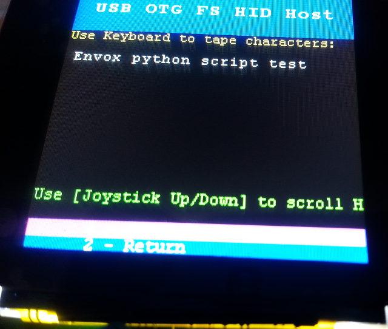

# STM32L4 >> STM32F4 USB keyboard

Cloned from:

https://github.com/STMicroelectronics/STM32CubeL4/tree/master/Projects/STM32L476G-EVAL/Applications/USB_Host/HID_Standalone

@note Care must be taken when using HAL_Delay(), this function provides accurate delay (in milliseconds)
      based on variable incremented in SysTick ISR. This implies that if HAL_Delay() is called from
      a peripheral ISR process, then the SysTick interrupt must have higher priority (numerically lower)
      than the peripheral interrupt. Otherwise the caller ISR process will be blocked.
      To change the SysTick interrupt priority you have to use HAL_NVIC_SetPriority() function.
      
@note The application needs to ensure that the SysTick time base is always set to 1 millisecond
      to have correct HAL operation.

For more details about the STM32Cube USB Host library, please refer to UM1720  
"STM32Cube USB Host library".

@par USB Library Configuration

It is possible to fine tune needed USB Host features by modifying defines values in USBH configuration
file “usbh_conf.h” available under the project includes directory, in a way to fit the application
requirements, such as:
- Level of debug: USBH_DEBUG_LEVEL
                  0: No debug messages
                  1: Only User messages are shown
                  2: User and Error messages are shown
                  3: All messages and internal debug messages are shown
   By default debug messages are displayed on the debugger IO terminal; to redirect the Library
   messages on the LCD screen, lcd_log.c driver need to be added to the application sources.

#### USB Host

By the schematics(page 46):
  
https://www.st.com/content/ccc/resource/technical/document/user_manual/group0/1f/0f/b1/86/ef/c7/45/84/DM00353127/files/DM00353127.pdf/jcr:content/translations/en.DM00353127.pdf
  
OTGID pin is on PA10

https://github.com/goran-mahovlic/usb_keyboard/blob/master/HID_Standalone/Src/usbh_conf.c#L58

Tested with the scope:

    PA10 is pullup by default
    If OTG cable is connected (no mather if keyboard is connected) PA10 goes LOW
    When OTG cable is removed PA10 goes HIGH
    If computes is connected PA10 stays HIGH

https://github.com/goran-mahovlic/usb_keyboard/blob/master/HID_Standalone/Src/stm32l4xx_it.c#L148

To check:

    [] Leve all this defined, use port as virtual serial, if interrupt hapens check PA10 status and switch SERIAL/HOST

USB host port events

https://github.com/STMicroelectronics/STM32CubeL4/blob/d00623f229d09f3a1be050bdb0606b8870fa5d1c/Middlewares/ST/STM32_USB_Host_Library/Core/Src/usbh_core.c#L433

CubeMx -- selecting dual role

Dual role does not generate code

https://community.st.com/s/question/0D50X0000APbLwS/cubemx-50-usb-otg-does-not-work

Not empty here:

https://github.com/CalPolyRobotics/IGVC-OlympusFirmware/blob/a1b29818d08725b2a760780ded1b70db80cdf0b2/master_boot/peripherals/USB/usb_otg.c
